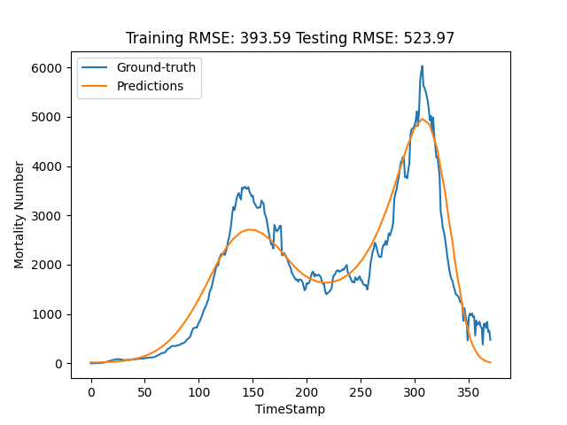
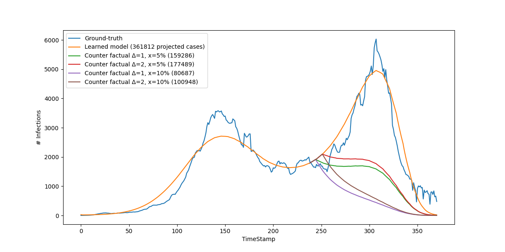

# Grad-Metapopulation Method

## Requirements

Use the package manager [conda](https://docs.conda.io/en/latest/) to install required Python dependencies. Note: We used Python 3.7.

```bash
conda env create -f environment.yml
```

## Training

### Quick Demo
To quickly evaluate our method on the Bogota dataset, run the following command for the GradMetapopulation Method:

```bash
bash scripts/run.sh 
```

For the LSTM Method, run the following code:

```bash
bash scripts/run_lstm.sh
```

If you want to acess our system with a user-friendly GUI, simply run the code:

```python
python src/index.py
```

### Data Preparation
<details>
  <summary>Step 1: Data Collection</summary>
  
Our method accepts a combination of public datasets (collected from online sources) and private datasets (i.e., financial transaction datasets). We here give a detailed decription of how to **collect** and **pre-process** the datasets.

The public datasets are collected from the following three sources. We will describe the included features and how to prepare them for your target city.

- **Infections Datasets**:
[Infections Datasets](Data/Processed/minimal_dataset.csv) is of the shape (#TimeStamps, #Features_inf), recording the `cases` and `deaths` for the Bogota city. Tu run the method on your target city, please prepare infections dataset with the similar format and at least contains features `year`, `cases`, and `deaths`. Save the infections datasets under the `Data/Processed/` directory with the same name `minimal_dataset.csv`.

- **Google Health Trends**: 
Search Google Health Trends is of the shape (#TimeStamps, #Features_ght), with the relevant terms such as `covid-19 en colombia`, `covid-19 hoy`, `covid-19 bogota`.
For example this [link](https://trends.google.com/trends/explore?date=today%205-y&geo=CO-DC&q=covid-19%20en%20colombia) provides an example of the time series of the term `covid-19 en colombia`. We provide a prepared datasets [here](Data/Processed/multiTimeline.csv) for your convience. To run the method on your target city, please prepare the GHT dataset with similar methods and save them under `Data/Processed/` directory with the same name `multiTimeline.csv`.

- **Mobility Dataset**:
The [Google Mobility Dataset](https://www.gstatic.com/covid19/mobility/Global_Mobility_Report.csv) covers from February 2020 up to October 2022, containing six features including `retail_and_recreation_percent_change_from_baseline`, `grocery_and_pharmacy_percent_change_from_baseline`, `parks_percent_change_from_baseline`, `transit_stations_percent_change_from_baseline`, `workplaces_percent_change_from_baseline`, `residential_percent_change_from_baseline`. This dataset can be directly downloaded without any changes unless your target city is not in the mobility dataset. Save them under `Data/Processed/` directory with the same name `Global_Mobility_Report.csv`.

For the private financial transaction dataset, we use [the one](Data/Processed/technical_phase_data.csv) provided by the PETs committee.

**IMPORTANT: Please make sure all the time series are in the same period.**

**IMPORTANT: If you incur any troubles or have any questions about the data preparation, please contact [Zihan](mailto:bxv6gs@virginia.edu).**

</details>


<details>
  <summary>Step 2: Data Pre-processing</summary>

Now we have the following two sources of datasets:
- **public dataset** i.e., Infections Datasets, Google Heath Trends, and Mobility Dataset. The total number of features that will be used for epidemics model learning will then be `#Features_inf + #Features_ght + 6`.
- **private dataset**, i.e., financial transacation dataset

To pre-process the public dataset, use the following commands:

```python
python src/prepare_dataset.py --moving_window 0 --week 49
python src/prepare_dataset.py --moving_window 0 --week 49 --test
```
- The week parameter controls the length of the training period (default: 49 weeks starting from 2020-03-01).
- The moving_window parameter specifies how many windows to expand from the given training period. It is used in the on-line setting experiments. **If you do not want to evaluate the on-line setting, simply set it as 0.**
- The --test flag extends the data by an additional four weeks, corresponding to the prediction horizon (i.e., 28 days).

To prepare the private dataset, use the following command:
```python
python src/prcess_data_dung.py --moving_window 0 --eps 1
```
- The moving_window parameter is used similarly here to control the expansion of windows.
- Note that this script will aggregate the privatized transaction dataset saved at `Data/Processed/private_agg_1.csv`. You can choose other $\epsilon \in \{1, 5, 10 \}$.

</details>


### Training and Evaluation
Our pipeline consists of two steps:

**Step 1: Model Training**

After preparing the datasets, run the following command to perform epidemic simulation and prediction:

```python
python src/main.py -st MA -j -d 0 --seed 1234 -m meta -di bogota -date "0_moving"
```
- Here the device parameter `-d` is set as "cuda:0". If you do not have GPU, simply set it as "cpu".

**Step 2: Visualize Experimental Results**

There will be several visualization results.
<details>
  <summary> Fitting plot saved under the `Figure-Prediction` directory </summary>



</details>

<details>
  <summary> Training loss curve saved under the `Figures` directory </summary>

  

</details>

<details>
  <summary> Parameters of the trained model saved under the `Results` directory
 </summary>


</details>


## Counterfactual Analysis

The counterfactual analysis is based on the prepared datasets (including public and private), and the trained model (file ending with .pt). After that, you could run the following command the get the counterfactual analysis results.

```bash
bash src/dung_run.sh
```

Then the counterfactual analysis will be saved at an image named 'counter_factual.png', e.g.,

