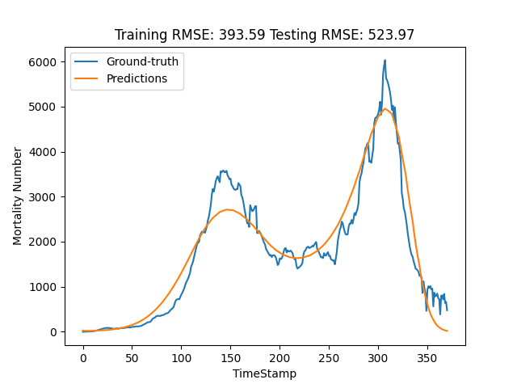
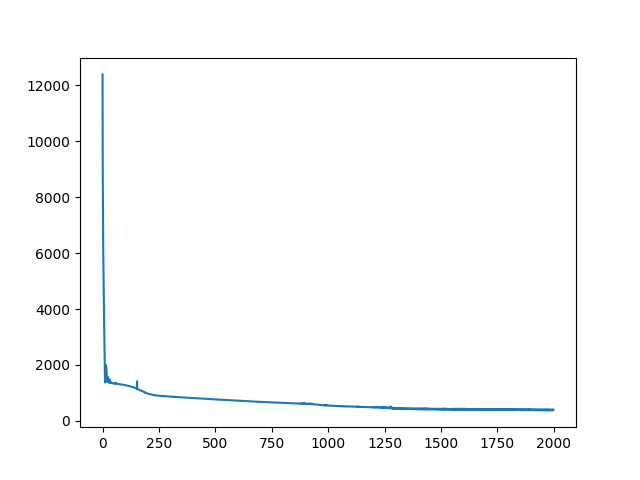
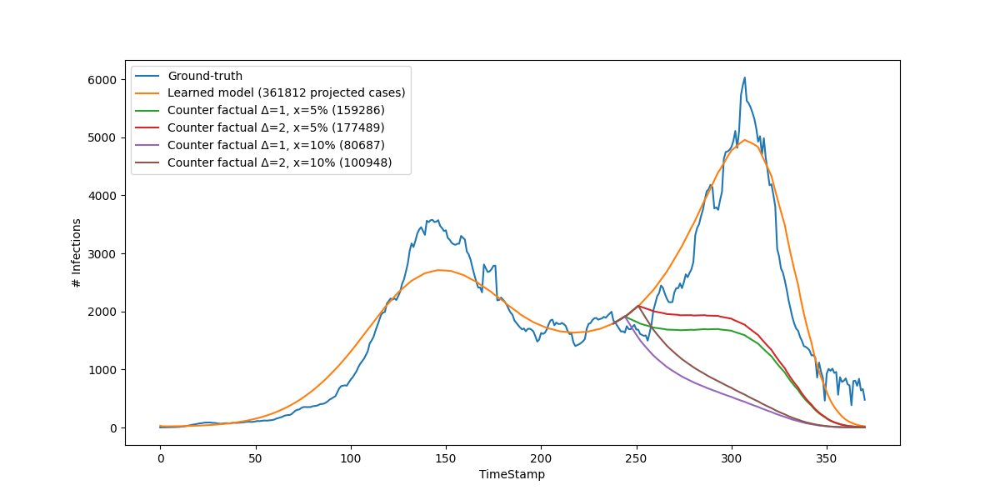

# Grad-Metapopulation Method

## Requirements

Use the package manager [conda](https://docs.conda.io/en/latest/) to install required Python dependencies. Note: We used Python 3.7.

```bash
conda env create -f environment.yml
```

## Training

### Quick Demo
To quickly evaluate our method on the Bogota dataset, run the following command:

```bash
bash scripts/run.sh 
```

If you want to acess our system with a user-friendly GUI, simply run the code (**currently still in progress, coming soon**):

```python
python src/index.py
```

### Detailed Steps
Our pipeline consists of two steps:

**Step 1: Data Preparation**
We use two types of data sources:
- **public dataset** such as Google Heath Trends, PCR, Mobility Dataset, and so on
- **private dataset**, i.e., financial transacation dataset

To prepare the public dataset, use the following commands:

```python
python src/prepare_dataset.py --moving_window 0 --week 49
python src/prepare_dataset.py --moving_window 0 --week 49 --test
```
- The week parameter controls the length of the training period (default: 49 weeks starting from 2020-03-01).
- The moving_window parameter specifies how many windows to expand from the given training period. It is used in the on-line setting experiments. **If you do not want to evaluate the on-line setting, simply set it as 0.**
- The --test flag extends the data by an additional four weeks, corresponding to the prediction horizon (i.e., 28 days).

To prepare the private dataset, use the following command:
```python
python src/prcess_data_dung.py --moving_window 0 --eps 1
```
- The moving_window parameter is used similarly here to control the expansion of windows.
- Note that this script will aggregate the privatized transaction dataset saved at `Data/Processed/private_agg_1.csv`. You can choose other $\epsilon \in \{1, 5, 10 \}$.

**Step 2: Model Training**

After preparing the datasets, run the following command to perform epidemic simulation and prediction:

```python
python src/main.py -st MA -j -d 0 --seed 1234 -m meta -di bogota -date "0_moving"
```
- Here the device parameter `-d` is set as "cuda:0". If you do not have GPU, simply set it as "cpu".

**Step 3: Check Experimental Results**

There will be several visualization results.
- Fitting plot saved under the `Figure-Prediction` directory

- Training loss curve saved under the `Figures` directory

- Parameters of the trained model saved under the `Results` directory


## Counterfactual Analysis

The counterfactual analysis is based on the prepared datasets (including public and private), and the trained model (file ending with .pt). After that, you could run the following command the get the counterfactual analysis results.

```bash
bash src/dung_run.sh
```

Then the counterfactual analysis will be saved at an image named 'counter_factual.png', e.g.,
